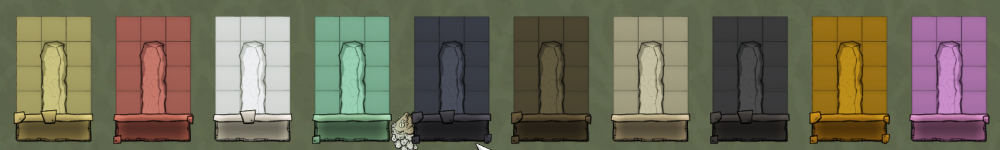
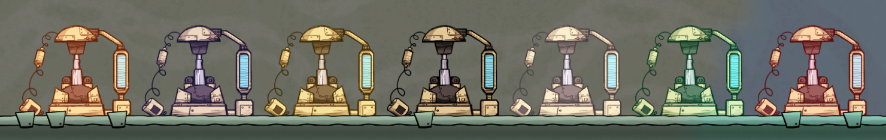
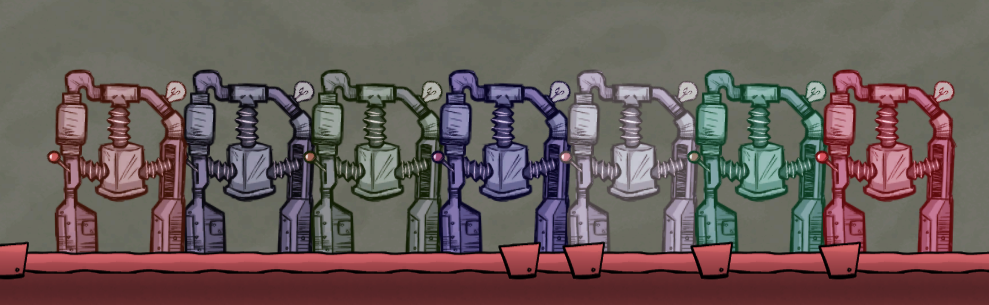
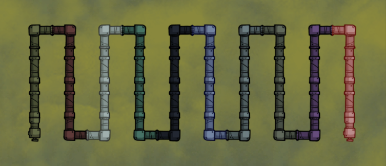

# ONI Modpack by Etiam

A bunch of mods made for Klei's Oxygen Not Included

I would never be able to do it without help of Cairath, javisar, octoshrimpy, Killface80 and others.

## Installation

Requires [@javisar](https://github.com/javisar)'s mod loader - [GitHub](https://github.com/javisar/ONI-Modloader) / [Forum Thread](https://forums.kleientertainment.com/forums/topic/88186-mods05-oni-modloader/)

After installation of modloader copy over contents of `=Output` directory to `Mods` directory in Oxygen Not Included installation directory.

## Mods preview

### MaterialColor

### GasOverlay

